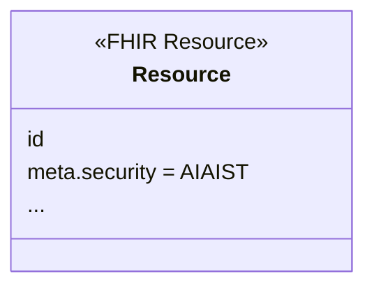
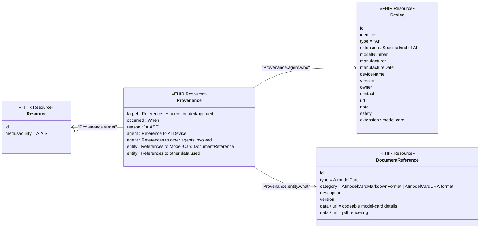

Four Observability Levels track and document when AI algorithms generate, modify, or enhance clinical data within FHIR healthcare resources. Each level addresses different transparency needs: 

- basic identification of AI-influenced data (Tagging), 
- detailed model documentation (Models), 
- comprehensive input tracking (Data Sources), and 
- human-AI collaboration governance (Process)

### Observability Factors for iterative IG development:

| 1: AI Usage Representation | 2: Model(s) | 3: Context | 4: Process (human-machine-interaction) |
|---|---|---|---|
| • resource-level<br>• field / element -level | • Name and version of the AI algorithm / model<br>• algorithm deterministic vs. non-deterministic vs. hybrid | **Request input (to AI)**<br>  - e.g.: Patient data | **Indicating**<br>  • multiple actors, including the human<br>  • role |
| &nbsp; | • Training set data<br>• Working memory | **Reference input**<br>  • e.g.: clinical guidelines | **How was it recorded**<br>  • Bias reduction strategies<br>  - e.g.: MCP to redirect to a controlled terminology corpus<br>  - tie back to Provenance |
| &nbsp; | &nbsp; | **Operations**<br>  • Model Context Protocol (MCP)<br>  • Agent to Agent (A2A) | &nbsp; |
| &nbsp; | &nbsp; | • Data quality<br>• Data qualification | &nbsp; |
{: .grid}

<br />

#### AI Usage Representation

Distinguishes where AI was used and not used.

#### Models

Describes characteristics of the AI model used to produce or influence the data.

Information in the Model field could include:

- name and version of the AI algorithm/model
- whether the algorithm is deterministic, non-deterministic, or a hybrid of the two
- training set data
- working memory

>💡 Tip
>
> Use When...

See [Model Examples](#provenance) for more details on how to use this Observability Dimension.
<br />

#### Data Sources

Data sources are information fed into a model to get an AI output (e.g.: inference, deduction, prediction) and identifies the related inputs to an AI model and operations used to [convey, produce, other?] information.

Information in the Data Sources field includes:

- **Request input**: Also referred to as a prompt, the primary healthcare data submitted to the AI system, including patient demographics, clinical notes, laboratory results, and imaging data
- **Reference input**: supplementary information provided to enhance AI decision-making, including clinical practice guidelines, drug interaction databases, treatment protocols, and evidence-based medicine resources
- **Operations**: the technical protocols used for AI interactions, including Model Context Protocol (MCP) for structured communication with AI systems and Agent-to-Agent (A2A) protocols for communication between different AI systems 
- **Data quality**: evaluates the completeness, accuracy, consistency, and reliability of input data 
- **Data qualification**: addresses the validation, certification, and regulatory compliance status of data sources

>💡 Tip
>
> Use When...

See [Data Source Examples](#data-source-examples) for more details on how to use this Observability Dimension.

#### Process

Process documents human-AI collaboration and governance aspects of AI-augmented healthcare workflows. There are two main components documented in Process: provenance and bias reduction strategies. 

**Provenance** is a comprehensive audit trail that identifies all contributors to the final clinical output, documenting both human healthcare providers and AI systems involved in the decision-making process. Role definition clarifies the specific responsibilities, authority levels, and decision-making boundaries of each contributor, whether human or artificial. 

**Bias reduction strategies** encompass active measures implemented to minimize algorithmic bias and ensure equitable healthcare outcomes, such as using MCP to redirect AI systems to controlled medical terminology corpuses that promote standardized and unbiased language. The connection between bias reduction efforts and provenance documentation ensures that mitigation strategies are traceable and accountable, linking specific interventions back to documented decision trails and outcome assessments.

Information in the Process field could include:

- Actor(s), including the human, and their roles
- Bias reduction strategies 
- Redirection to a controlled terminology corpus

>💡 Tip
>
> Use When...

See [Process](#process-examples) for more details on how to use this Observability Dimension.

### AI Representation Methods - the way you get that information

Implementers can utilize these methods based on their specific requirements and organizational capabilities for representing AI-generated content.

| 1: Security Tagging | 2: Provenance |
|---|---|
| Tagging data influenced by AI | • **Specifying**<br>  - source, target<br>  - AI Model Cards |
{: .grid}

Note that both Security Tagging and Provenance can be applied at the whole Resource level or at the Element level within a resource.

### Tagging

The use of Tagging enables distinguishing data that has not been influenced by AI from data that has been influenced by AI. The level of influence and the details about how the AI was used are not available in a Tagging methodology. However the Tagging methodology is very light weight as it indicates simply that AI was used in the creation or updating of the given resource. All FHIR Resources include the meta element which includes the security element. Thus all resources can be tagged this way regardless of the type of Resource.



<!---
The following link was included in the Tagging Explainer but links to provenance. Not sure if this is correct.
We include a [valueSet](ValueSet-ProvenanceVS.html) that assembles our codes and those defined elsewhere.

Consider finding more descriptive label
-->

**Resource tag**

A Resource tag indicates that the whole Resource is influenced by the code assigned. 

- [Profile on ANY resource that is tagged with AI involvement](StructureDefinition-AI-data.html)

Use when an example is completely authored by an AI.

- [Example Observation with AI Assisted security labels](Observation-glasgow.html)

The key portion of that Resource is the following meta.security element holding the `AIAST` code. `AIAST` is an HL7 Observation value for metadata that indicates that AI was invovled in producing the data or information. 

<!---
Note, I don't think the description I added for AIAST is the best so including it more as a placeholder for now.
-->

Discussion has indicated that a few more codes might be useful. For this we create a local [codeSystem](CodeSystem-AddedProvenanceCS.html) to allow us to experiment. Eventually useful codes would be proposed to HL7 Terminology (THO). For example `AIAST` does not indicate if a clinician was involved in the use of the AI, or reviewed the output of the AI. 

```json
{
  "resourceType" : "Observation",
  "id" : "glasgow",
  "meta" : {
    "security" : [
      {
        "system" : "http://terminology.hl7.org/CodeSystem/v3-ObservationValue",
        "code" : "AIAST",
        "display" : "Artificial Intelligence asserted"
      }
    ]
  },
  "text" : {
    ...
```

**Element tag within a Resource**

An Element tag will indicate that an element or a few elements within a Resource were influenced by AI, but not the whole Resource.
Use when components of an example were authored by AI, but not the whole Resource.

meta.security holds a code defined in [DS4P Inline Security Labels]({{site.data.fhir.ds4p}}/inline_security_labels.html) - `PROCESSINLINE`, and the `inline-sec-label` extension is on each element that was influenced by AI to indicate it is an AI asserted value. 

- [DiagnosticReport with Inline AI Security Labels](DiagnosticReport-f202.html)

One of the key portions of that Resource is

```json
  "conclusionCode" : [
    {
      "extension" : [
        {
          "url" : "http://hl7.org/fhir/uv/security-label-ds4p/StructureDefinition/extension-inline-sec-label",
          "valueCoding" : {
            "system" : "http://terminology.hl7.org/CodeSystem/v3-ObservationValue",
            "code" : "AIAST",
            "display" : "Artificial Intelligence asserted"
          }
        }
      ],
      "coding" : [
        {
          "system" : "http://snomed.info/sct",
          "code" : "428763004",
          "display" : "Staphylococcus aureus bacteraemia"
        }
      ]
    }
  ]
```

### Provenance

Model(s) Examples
Model documentation captures comprehensive information about the AI algorithms used in processing healthcare data. The name and version specification ensures precise identification of the specific AI model and its iteration used, enabling reproducibility and version control. Algorithm classification distinguishes between deterministic systems (rule-based, predictable outputs), non-deterministic systems (machine learning models with probabilistic outputs), and hybrid approaches that combine both methodologies. Training set data documentation provides transparency about the datasets used to develop the AI model, including information about data sources, population demographics, and potential biases. Working memory refers to the contextual information and temporary data that the AI model maintains during processing, which can influence decision-making and outputs.

Given some data are influenced by AI, the following diagram shows how Provenance can point at that data and indicate which AI model was used with specific Model-Card details.



- [Profile of Provenance describing AI as involved](StructureDefinition-AI-Provenance.html)

### Defining the AI

An AI is defined using the Device resource. The Device resource is defined in FHIR to be much broader than physical devices, and specifically includes software, and thus AI. Thus an AI would be identified by some kind of identifier, manufacture, type, version, web location, etc.

- [Profile of Device for describing an AI](StructureDefinition-AI-device.html)
- [The AI System](Device-TheAI.html)

Where a given AI will always use a given Model-Card, that Model-Card can be included in the Device definition using a Model Card Description extension.

### Using Model-Card

The AI community is defining standards for describing an AI model.
There are two Model-Card formats shown in this Guide, although other formats may be used as well.

The Model-Card represents the request that was made of the AI. The Model-Card can be encoded in a [AI Model Card profiled DocumentReference](StructureDefinition-AI-ModelCard.html), and these would be referenced in a [AI profiled Device](StructureDefinition-AI-Device.html) or within the [Provenance describing the AI involvement](StructureDefinition-AI-Provenance.html)

#### Hugging Face Markdown

The Hugging Face Model Card is a combination of YAML that defines in codeable terms the details, and a Markdown that describes it in narrative. Given that Markdown can carry YAML, the overall object is Markdown.

Example Model Card from https://github.com/huggingface/huggingface_hub/tree/main/tests/fixtures/cards

Here is an example given:

```markdown
---
language:
- en
license:
- bsd-3-clause
annotations_creators:
- crowdsourced
- expert-generated
language_creators:
- found
multilinguality:
- monolingual
size_categories:
- n<1K
task_categories:
- image-segmentation
task_ids:
- semantic-segmentation
pretty_name: Sample Segmentation
---
```

The example above encoded in a [DocumentReference with Model Card encoded inside](DocumentReference-ModelCard-sample-huggingface-attached.html)

#### CHAI Applied Model Cards XML

The [Coalition for Health AI (CHAI) Applied Model Card](https://www.chai.org/workgroup/applied-model) utilizes XML encoding, and PDF rendering. 

An example from the [CHAI Github Examples](https://github.com/coalition-for-health-ai/mc-schema) is included here in multiple DocumentReference formats:

- [DocumentReference linked to a web respository where the Model Cards exist](DocumentReference-ModelCard-sample-CHAI-web.html)
- [DocumentReference with Model Card encoded using FHIR Binary resources](DocumentReference-ModelCard-sample-CHAI-binary.html)
- [DocumentReference with Model Card encoded inside](DocumentReference-ModelCard-sample-CHAI-attached.html)

Note that these are all the same example Model Card, just encoded different ways depending on the needs. These three encoding methods are available for the HuggingFace format as well. Note that in the case of CHAI format, these examples include both the XML and the PDF rendering of the same as different .content entries.

#### R5/R6

In R5/R6 of FHIR core the Device resource has a `.property` element with a `.property.type` we can use to indicate the model-card, and place the model-card markdown into `.property.valueAttachment` as markdown string. (It could go into `.valueString` if we know it will be markdown, but that is not strongly clear.)

#### R4 Simply put the Model-Card markdown into the note.text of the Device

One choice is to just put that Markdown Model-Card into the Device.note.text element. This is not wrong from the definition of that element, but it may not be obvious to one looking at the Device resource that there is meaning to the markdown given.

- [Device with Model-Card in Device.note.text](Device-Note-ModelCard.html)

#### Attachment for the Model-Card

One could encode the Model-Card in a resource designed for carrying any mime-type, the DocumentReference. To make this more clear and searchable we define a [codeSystem](CodeSystem-AImodelCardCS.html) that has some codes to be used to identify that the DocumentReference is specifically an AI Model Card or an AI Input Prompt

- [Profile of DocumentReference to carry a Model-Card](StructureDefinition-AI-ModelCard.html)
- [DocumentReference Hugging Face Model-Card](DocumentReference-ModelCard-sample-huggingface-attached.html)
- [Extension for including the Model-Card in a Device](StructureDefinition-aitransparency.modelCardDescription.html)
- [Device with attached Model-Card](Device-Attached-ModelCard.html)

### Data Source Examples

Data Sources documents all inputs and operational frameworks involved in AI processing. 

*Insert example scenarios for using data source documentation*

#### Using Input Prompt

One useful thing to record is the Input Prompt given to the AI. This input prompt can be very important to the output, and the interpretation of the output. The Input Prompt is recorded as an attachment, using the DocumentReference, and using a code as defined above

- [Input Prompt lorem ipsum](DocumentReference-Input-Prompt-lorem-ipsum.html)
- [Input Prompt to create a Patient](DocumentReference-Input-Prompt-create-patient.html)

The first example is just showing the encapsulating mechanism. The Second example is a prompt that might be used to have the AI create a given Patient resource that meets the input requirements.

- [Provenance of creating a Patient from Input Prompt](Provenance-AI-generated-patient-resource.html)
- [Patient resource created](Patient-a1b2c3d4-e5f6-7890-abcd-ef1234567890.html)

### Process Examples

#### Resource-level

As with tagging, a Provenance can point at a whole Resource. In this way one can carry details in the Provenance, such as what AI was used and how.

- [Provenance of AI authored Lab Observation](Provenance-AI-Contributed.html)

#### Element-level

Provenance can be just about some elements within a Resource. This is a normal part of Provenance, but it is important for AI use-cases.

- [Provenance of AI Authored Procedure.followup.text](Provenance-AI-Authored-Element.html)

#### Full Process example

[This is a full example](Provenance-AI-full-lorem-ipsum.html) of how to capture the AI process in FHIR.

- Two outputs that this Provenance resource is documenting:
    - an Observation resource (e.g., lab result)
        - with Observation.interpretation being attributed to this Provenance
    - a CarePlan resource (e.g., follow-up care plan)
- Two agents
    - a verifier (human) who verifies the AI output
    - an author (AI system) who generated the output
- Two entities that were clinical resources provided to the AI system
    - a DocumentReference resource (e.g., patient summary)
    - an Observation resource (e.g., lab result)
- One entity that is a PlanDefinition resource (e.g., care plan definition)
- One entity that is the AI Input Prompt
    - Where the Input Prompt is a DocumentReference resource that contains the input prompt provided to the AI system.
    - Where the Input Prompt is a contained resource in the Provenance resource.
    - Where the Input Prompt is associated with the clinician which provided it

#### PDF interpreted by AI into FHIR

Use Case: A provider receives a [PDF of lab result(s)](DocumentReference-Lab-Results-PDF.html) for a patient. This PDF is examined by an AI which generates a [Bundle with a Patient resource and Observation resource(s)](Bundle-b3c1f2d4-5c8e-4b0a-9f6d-7c8e1f2d4b5c.html).

In the attached example the patient's name is Alton Walsh and the lab test is an HbA1C. All the FHIR resources in the bundle have been created by the AI, so they should be tagged accordingly.

- [Provenance of AI Generated Lab Results](Provenance-AI-Generated-Lab-Results.html)

