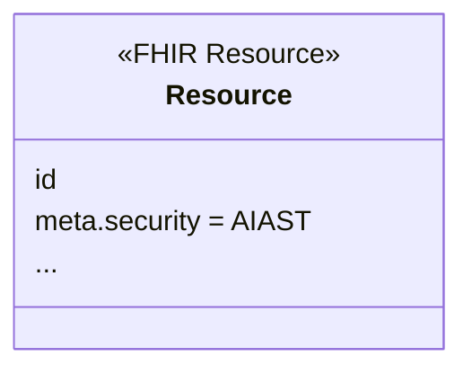
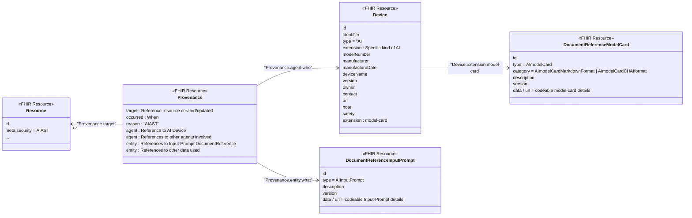

The goal of this implementation guide is to provide observability of the use of AI in the production or manipulation of health data. To the end user, this means that in some way they can determine first that AI was involved and then discover more information about the AI and its usage. From this, we can understand that there are two levels of observability and multiple factors that can be observed within the second level. 

- 1st Level Observability: **Tagging** - this provides the indication that AI was involved in some way with the data. It provides no details about AI's involvement, but gives an indication that the end user may wish to investigate further. This level is intended to be lightweight, not adding significant bloat to the payload or requiring additional lookups on the part of the client system. For this, this guide details the use of Security Labels (see [Tagging](#tagging) below).
- 2nd Level Observability: **AI Observability Factors** - there are a number of details that may be of interest to the end user about what and how AI was used. The factors covered in this IG are introduced [below](#ai-observability-factors) and then explained in the rest of this page. To provide observability into these factors, this guide details the use of the Provenance resource.

**Note:** that both Security Labels and Provenance can be applied at the whole Resource level or at the Element level within a resource.

<div class="stu-note">
The use of tagging to achieve 1st level observability provides the end user or client system with a useful indicator of AI involvement without resulting in significant bloat in the payload. The presence of a tag can tell the user or system that they may want to look for a Provenance resource that will provide more details. <br/><br/>

It is possible to achieve both levels of observability by using only Provenance. In some use cases, the presence of tags may have adverse effects, so this guide does not enforce tagging. However, doing this is less interoperable because it depends on the end user or client system always checking for Provenance. <br/><br/>

The presence of both tags and Provenance provides for the best interoperability because the end user or client system does not need to do an extra lookup for Provenance on every resource. This is strongly recommended by this guide.
</div>

### AI Observability Factors

Beyond 1st level observability, there are a number of factors that the end user or client system may be interested in knowing about. These factors can be broken down into 3 categories:

1. Model(s) - definition of the AI(s) used (see [Defining the AI](#defining-the-ai-model)) 
  - Name and version of the AI algorithm / model
  - Organization that produced the model
  - Is the algorithm deterministic or non-deterministic
  - Data set used in training the model(s)
  - ...
2. Context - input data provided to the AI to produce or manipulate outputs (see [Context of AI Usage](#context-of-ai-usage))
  - Prompts, including system and user prompts
  - Patient data, such as health records
  - Reference input, such as clinical practice guidelines 
  - ...
3. Process - the interactions between AI(s), human(s), and system(s) (see [Process Utilizing AI](#process-utilizing-ai))
  - Human reviews (human-in-the-loop)
  - Multi-agent interactions, such as use of Agent-to-Agent protocol (A2A)
  - Tool calling, such as use of Model Context Protocol (MCP)
  - Guardrails for bias reduction, inappropriate responses, undesired actions, ...
  - ...

### Tagging

The use of tagging enables distinguishing data that has not been influenced by AI from data that has been influenced by AI. The level of influence and the details about how the AI was used are not provided by simple tagging. However, tagging is very light weight and does not add significant bloat to the payload or additional lookups. Tagging can be used as an indicator that AI was used in the creation or updating of the given resource and that a client system may wish to investigate further by fetching the Resource's Provenance.

>💡 Tip
>
> Use when one needs to quickly and easily identify Resources or elements inside a Resource that have been influenced by AI.

Tagging (also called [Security Labels](https://hl7.org/fhir/security-labels.html)) uses the FHIR [Resource definition](https://hl7.org/fhir/resource.html) `.meta.security` element that is at the top of all Resources, and as such can be found without Resource type specific processing. The use of security tagging follows the purpose for security tagging, as the domain of security covers protections against risks to Confidentiality, Availability, and Integrity (see [Healthcare Privacy and Security Classification System (HCS) vocabulary](https://hl7.org/fhir/security-labels.html#hcs)). In this case focusing on [Integrity](https://terminology.hl7.org/ValueSet-v3-SecurityIntegrityObservationValue.html) is defined as completeness, veracity, reliability, trustworthiness, and provenance. In the case of AI Transparency we want to mark the AI participation to convey reliability, trustworthiness, and provenance.

Within the [Integrity Security Tags Vocabulary](https://terminology.hl7.org/ValueSet-v3-SecurityIntegrityObservationValue.html) is [AIAST - Artificial Intelligence Asserted](https://terminology.hl7.org/CodeSystem-v3-ObservationValue.html#v3-ObservationValue-AIAST) as a broad concept of any influence by any kind of artificial intelligence. There is also [DICTAST - Dictation asserted](https://terminology.hl7.org/CodeSystem-v3-ObservationValue.html#v3-ObservationValue-DICTAST) for when dictation, which might be AI driven, has been involved in translating dictation to data.


```mermaid
classDiagram
    class Resource {
        <<FHIR Resource>>
        id
        meta.security = AIAST
        ...
    }
```

<!---
The following link was included in the Tagging Explainer but links to provenance. Not sure if this is correct.
We include a [valueSet](ValueSet-ProvenanceVS.html) that assembles our codes and those defined elsewhere.

Consider finding more descriptive label
-->

#### Resource tag

A Resource tag indicates that the whole Resource is influenced by the code assigned.

- [Profile on ANY resource that is tagged with AI involvement](StructureDefinition-AI-data.html)

Use when an example is completely authored by an AI.

- [Example Observation with AI Assisted security labels](Observation-glasgow.html)

The key portion of that Resource is the following meta.security element holding the `AIAST` code. `AIAST` is an HL7 Observation value for metadata that indicates that AI was invovled in producing the data or information.

<!---
Note, I don't think the description I added for AIAST is the best so including it more as a placeholder for now.
-->

Discussion has indicated that a few more codes might be useful. For this we create a local [codeSystem](CodeSystem-AddedProvenanceCS.html) to allow us to experiment. Eventually useful codes would be proposed to HL7 Terminology (THO). For example `AIAST` does not indicate if a clinician was involved in the use of the AI, or reviewed the output of the AI.

```json
{
  "resourceType" : "Observation",
  "id" : "glasgow",
  "meta" : {
    "security" : [
      {
        "system" : "http://terminology.hl7.org/CodeSystem/v3-ObservationValue",
        "code" : "AIAST",
        "display" : "Artificial Intelligence asserted"
      }
    ]
  },
  "text" : {
    ...
```

#### Element tag within a Resource

An Element tag will indicate that an element or a few elements within a Resource were influenced by AI, but not the whole Resource.
Use when components of an example were authored by AI, but not the whole Resource.

meta.security holds a code defined in [DS4P Inline Security Labels]({{site.data.fhir.ds4p}}/inline_security_labels.html) - `PROCESSINLINE`, and the `inline-sec-label` extension is on each element that was influenced by AI to indicate it is an AI asserted value.

- [DiagnosticReport with Inline AI Security Labels](DiagnosticReport-f202.html)

One of the key portions of that Resource is

```json
  "conclusionCode" : [
    {
      "extension" : [
        {
          "url" : "http://hl7.org/fhir/uv/security-label-ds4p/StructureDefinition/extension-inline-sec-label",
          "valueCoding" : {
            "system" : "http://terminology.hl7.org/CodeSystem/v3-ObservationValue",
            "code" : "AIAST",
            "display" : "Artificial Intelligence asserted"
          }
        }
      ],
      "coding" : [
        {
          "system" : "http://snomed.info/sct",
          "code" : "428763004",
          "display" : "Staphylococcus aureus bacteraemia"
        }
      ]
    }
  ]
```

### Defining the AI Model

There are a number of observability factors beyond simple tagging that are of interest to end users and downstream systems. Chief among these is the nature of the AI itself. The user would like to understand what algorithm / model was used, who developed it, how it was trained, any certifications it has, and so on... To do this, the guide outlines the use of the Provenance resource, which can then be linked to Device and DocumentReference to point to a Model-Card.

>💡 Tip
>
> Use when the AI model is important to the use-cases, such as when it may be important to understand which AI model was used.

The industry is converging around standards for providing this information, generally called Model-Cards. Several different standards are emerging, including [Hugging Face](#hugging-face-markdown) and [CHAI Model Cards](#chai-applied-model-cards-xml). This guide does not enforce any particular Model-Card, but does show how to encode any Model-Card in a [AI Model-Card profiled DocumentReference](StructureDefinition-AI-ModelCard.html), and these would be referenced in a [AI profiled Device](StructureDefinition-AI-Device.html) or within the [Provenance describing the AI involvement](StructureDefinition-AI-Provenance.html). This looks like:



```mermaid
classDiagram
    direction LR
    class Resource {
        <<FHIR Resource>>
        id
        meta.security = AIAST
        ...
    }

    class Provenance {
        <<FHIR Resource>>
        target : Reference resource created/updated
        occurred : When
        reason : `AIAST`
        agent : Reference to AI Device
        agent : References to other agents involved
        entity : References to Input-Prompt DocumentReference
        entity : References to other data used
    }

    class Device {
        <<FHIR Resource>>
        id
        identifier
        type = "AI"
        extension : Specific kind of AI
        modelNumber
        manufacturer
        manufactureDate
        deviceName
        version
        owner
        contact
        url
        note
        safety
        extension : model-card
    }

    class DocumentReferenceModelCard {
        <<FHIR Resource>>
        id
        type = AImodelCard
        category = AImodelCardMarkdownFormat | AImodelCardCHAIformat
        description
        version
        data / url = codeable model-card details
    }

    class DocumentReferenceInputPrompt {
        <<FHIR Resource>>
        id
        type = AIInputPrompt
        description
        version
        data / url = codeable Input-Prompt details
    }

    Resource "1..*" <-- Provenance : "Provenance.target"
    Provenance --> Device : "Provenance.agent.who"
    Device --> DocumentReferenceModelCard : "Device.extension.model-card"
    Provenance --> DocumentReferenceInputPrompt : "Provenance.entity.what"
```

Examples:

- [Profile of Provenance describing AI as involved](StructureDefinition-AI-Provenance.html)
- [The AI System as a Device](Device-TheAI.html)

#### Hugging Face Markdown

The Hugging Face Model-Card is a combination of YAML that defines in codeable terms the details, and a Markdown that describes it in narrative. Given that Markdown can carry YAML, the overall object is Markdown.

Example Model-Card from https://github.com/huggingface/huggingface_hub/tree/main/tests/fixtures/cards

Here is an example given:

```markdown
---
language:
- en
license:
- bsd-3-clause
annotations_creators:
- crowdsourced
- expert-generated
language_creators:
- found
multilinguality:
- monolingual
size_categories:
- n<1K
task_categories:
- image-segmentation
task_ids:
- semantic-segmentation
pretty_name: Sample Segmentation
---
```

The example above is encoded in a [DocumentReference with Model-Card encoded inside](DocumentReference-ModelCard-sample-huggingface-attached.html)

#### CHAI Applied Model-Cards XML

The [Coalition for Health AI (CHAI) Applied Model Card](https://www.chai.org/workgroup/applied-model) utilizes XML encoding and PDF rendering.

An example from the [CHAI Github Examples](https://github.com/coalition-for-health-ai/mc-schema) is included here in multiple DocumentReference formats:

- [DocumentReference linked to a web respository where the Model-Cards exist](DocumentReference-ModelCard-sample-CHAI-web.html)
- [DocumentReference with Model-Card encoded using FHIR Binary resources](DocumentReference-ModelCard-sample-CHAI-binary.html)
- [DocumentReference with Model-Card encoded inside](DocumentReference-ModelCard-sample-CHAI-attached.html)

Note that these are all the same example Model-Card, just encoded different ways depending on the needs. These three encoding methods are available for the HuggingFace format as well. Note that in the case of CHAI format, these examples include both the XML and the PDF rendering of the same as different .content entries.

##### Support for FHIR R5/R6

In FHIR R5/R6 of FHIR core the Device resource has a `.property` element with a `.property.type` we can use to indicate the model-card, and place the model-card markdown into `.property.valueAttachment` as markdown string. (It could go into `.valueString` if we know it will be markdown, but that is not strongly clear.)

##### FHIR R4 Simply put the Model-Card markdown into the note.text of the Device

One choice is to just put that Markdown Model-Card into the Device.note.text element. This is not wrong from the definition of that element, but it may not be obvious to one looking at the Device resource that there is meaning to the markdown given.

- [Device with Model-Card in Device.note.text](Device-Note-ModelCard.html)

##### Attachment for the Model-Card

One could encode the Model-Card in a resource designed for carrying any mime-type, the DocumentReference. To make this more clear and searchable we define a [codeSystem](CodeSystem-AImodelCardCS.html) that has some codes to be used to identify that the DocumentReference is specifically an AI Model-Card or an AI Input Prompt

- [Profile of DocumentReference to carry a Model-Card](StructureDefinition-AI-ModelCard.html)
- [DocumentReference Hugging Face Model-Card](DocumentReference-ModelCard-sample-huggingface-attached.html)
- [Extension for including the Model-Card in a Device](StructureDefinition-aitransparency.modelCardDescription.html)
- [Device with attached Model-Card](Device-Attached-ModelCard.html)

### Context of AI Usage

When using an AI it is necessary to supply it with certain inputs. These inputs very based on the AI involved, but the industry generally refers to these inputs as the "prompt" (especially in the case of Generative AI). 

>💡 Tip
>
> Use when the record needs to show the data inputs, such as to understand what data the AI had to inference on, vs what data was not provided.

There are different kinds of prompts supplied, including but not limited to:

- **System Prompt:** Instructions to the AI on what to do and how to handle user inputs. These can also include reference information, such as clinical practice guidelines, drug interaction databases, treatment protocols, and evidence-based medicine resources that will enhance the AI decision-making. 
- **User Prompt:** Input from the user. This often includes the question to answer or problem to solve. In many cases this is a templated text that allows for the inserting of additional data (note some systems allow other prompt types to include files as additional data). This additional data can include patient demographics, clinical notes, laboratory results, imaging data, and other health data that will be useful to the AI decision-making.

In general, inputs should be captured using a [Input-Prompt DocumentReference](StructureDefinition-AI-InputPrompt.html) linked through the Provenance, but when specific clinical data is involved a FHIR Bundle or other resource MAY also be linked.

> Note
>
> There is significant variation in what and how AI systems inputs are supplied, however capturing those inputs should remain relatively consistent.

#### Context Examples

The context documents all inputs involved in AI processing.

One useful thing to record is the prompt(s) given to the AI. This prompt(s) can be very important to the output, and the interpretation of the output. The prompt(s) is recorded as an attachment, using the [Input-Prompt DocumentReference](StructureDefinition-AI-InputPrompt.html), and using a code as defined above

- [Input Prompt lorem ipsum](DocumentReference-Input-Prompt-lorem-ipsum.html)
- [Input Prompt to create a Patient](DocumentReference-Input-Prompt-create-patient.html)

The first example is just showing the encapsulating mechanism. The Second example is a prompt that might be used to have the AI create a given Patient resource that meets the input requirements.

- [Provenance of creating a Patient from Input Prompt](Provenance-AI-generated-patient-resource.html)
- [Patient resource created](Patient-a1b2c3d4-e5f6-7890-abcd-ef1234567890.html)

### Process Utilizing AI

AI Models do not exist in a vacuum, in addition to the context / inputs, there needs to be a system that calls the AI, supplies the inputs, and gets the result. This result may then be used as-is, supplied to another AI, verified by an automated system, verified by a human, or any number of other activities. Understanding this process may be very important to end users and downstream systems. For example, if the results of the AI were verified by a human (human-in-the-loop) then an end user may be able to rely on the results with less scrutiny.

>💡 Tip
>
> Use when all possible factors are important to record. This level of Observability Factor is very comprehensive, and as such is very verbose. This level of Observability Factor capturing may not be justified beyond initial model use, while shaking out the use.

Some of the process elements that may be captured are:

- **Human-in-the-loop:** This is when a human verifies the results of an AI output. This can add validity to those results. It can be captured in Provenance as that person is another author of the resulting resource or element.
- **Guardrails:** An automated system is engaged to check the results of the AI. This system can take many different forms. It is often intended to reduce bias, ensure more equitable healthcare outcomes, catch unacceptable outputs, such as inappropriate word usage, or do general validation, such as running a FHIR validator on the resource to ensure conformity. This can be captured as additional Devices as authors on the Provenance.  
- **Other AI or Systems:** Sometimes the AI may call subroutines called tools. These tools may do things like simple math, API calls, or web searches. This is often done using MCP. Additional, multiple AI systems maybe involved. Agenetic systems often involve multiple AI Agents who call each other using protocols like A2A. These workflows are complex to capture, but one suggestion is to use BPMN contained in DocumentReferences linked to the Provenance (example coming...).

#### Process Examples

##### Resource-level

As with tagging, a Provenance can point at a whole Resource. In this way one can carry details in the Provenance, such as what AI was used and how.

- [Provenance of AI authored Lab Observation](Provenance-AI-Contributed.html)

##### Element-level

Provenance can be just about some elements within a Resource. This is a normal part of Provenance, but it is important for AI use-cases.

- [Provenance of AI Authored Procedure.followup.text](Provenance-AI-Authored-Element.html)

##### Full Process example

[This is a full example](Provenance-AI-full-lorem-ipsum.html) of how to capture the AI process in FHIR.

- Two outputs that this Provenance resource is documenting:
  - an Observation resource (e.g., lab result)
    - with Observation.interpretation being attributed to this Provenance
  - a CarePlan resource (e.g., follow-up care plan)
- Two agents
  - a verifier (human) who verifies the AI output
  - an author (AI system) who generated the output
- Two entities that were clinical resources provided to the AI system
  - a DocumentReference resource (e.g., patient summary)
  - an Observation resource (e.g., lab result)
- One entity that is a PlanDefinition resource (e.g., care plan definition)
- One entity that is the AI Input Prompt
  - Where the Input Prompt is a DocumentReference resource that contains the input prompt provided to the AI system.
  - Where the Input Prompt is a contained resource in the Provenance resource.
  - Where the Input Prompt is associated with the clinician which provided it

### PDF interpreted by AI into FHIR

This is an additional example provided that shows how this IG can be applied.

Use Case: A provider receives a [PDF of lab result(s)](DocumentReference-Lab-Results-PDF.html) for a patient. This PDF is examined by an AI which generates a [Bundle with a Patient resource and Observation resource(s)](Bundle-b3c1f2d4-5c8e-4b0a-9f6d-7c8e1f2d4b5c.html).

In the attached example the patient's name is Alton Walsh and the lab test is an HbA1C. All the FHIR resources in the bundle have been created by the AI, so they should be tagged accordingly.

- [Provenance of AI Generated Lab Results](Provenance-AI-Generated-Lab-Results.html)

### Security and Privacy Considerations

- The Input Prompt and Context may contain sensitive information, such as patient data, and should be protected accordingly. The same goes for the Model-Card if it contains sensitive information about the AI model that should not be public.
