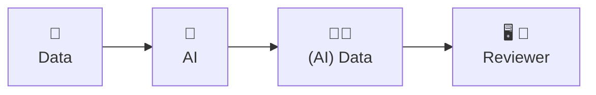
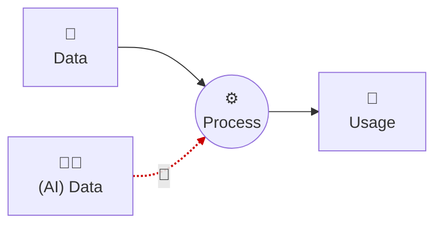
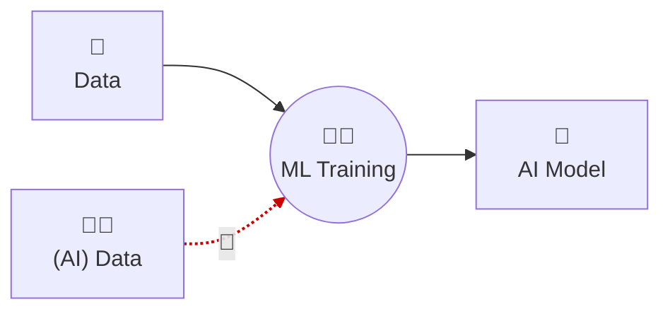
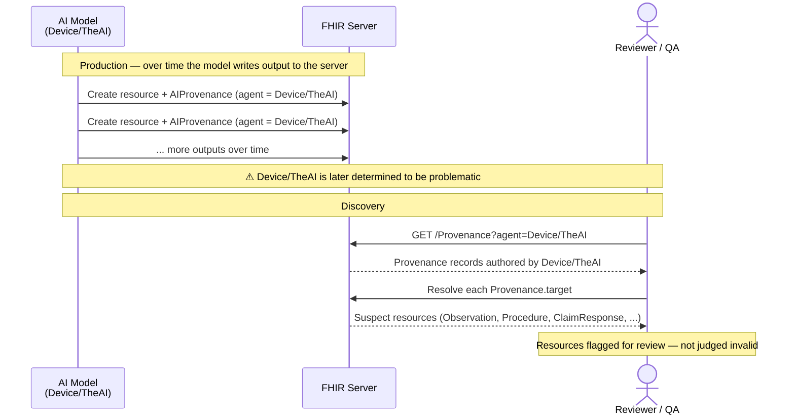
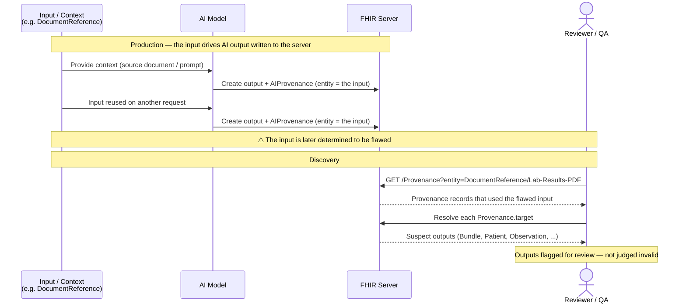

Observability of the use of AI in the production or manipulation of health data matters for many reasons. This guide organizes those reasons into **four general use cases**. Each is a broad category that covers many more specific scenarios, and each is illustrated below with concrete examples drawn from the artifacts in this guide.

All four use cases rest on the two mechanisms described in the [General Guidance](general_guidance.html): lightweight **tagging** (a `meta.security` label that signals AI was involved) and the **Provenance** resource (which carries the details — the AI model, the inputs, and the process). Tagging answers *"was AI involved?"* cheaply; Provenance answers *"how, by what, and with what oversight?"* authoritatively.

### Use Case 1: AI Attribution in Documentation Review

Anyone reviewing health data may want to know whether AI was involved in producing or manipulating that data, to what degree, and whether a human reviewed the result. This is the most common use case, and it applies far beyond the clinician at the bedside — it applies to **any actor reviewing FHIR data**, including researchers, payers and other administrators, quality and safety reviewers, and legal teams.

The need parallels long-standing practice: just as a reviewer expects to know which human authored a note, their role, and their qualifications, they increasingly need to distinguish content produced by AI, assisted by AI, and produced without any AI involvement.

The same use case takes a different shape depending on who is reviewing the data and why. The table below illustrates a few of the actors and the questions AI attribution helps them answer:

**Data Review Questions by Actor**

| When this Actor is reviewing data | The key questions may be... |
|--------------------------------|----------------------------|
| Clinician | What is happening (to modify)? Why is it happening? Was the AI output reviewed by a human? |
| Researcher | Is this data suitable for my study, or should AI-influenced data be excluded or stratified? |
| Payer | What matches prior-authorization criteria, and was the determination drafted by AI? |
| Quality Improvement | What matches the desired outcomes, or desired approach to care? |
| Safety Board | Multiple questions for root-cause analysis |
| Legal | Who — or what — is responsible? |
{: .grid}

#### Examples

**A whole resource produced by AI.** The [Observation with AI-asserted security labels](Observation-glasgow.html) carries the `AIAST` tag on `meta.security`, signaling to any reviewer that the entire Observation was AI-asserted.

**Only part of a resource produced by AI.** The [DiagnosticReport with inline AI security labels](DiagnosticReport-f202.html) tags only the `conclusion` and `conclusionCode` elements. A reviewer can see that AI asserted the interpretation while the rest of the report was not AI-influenced.

**Seeing the degree of involvement and human oversight.** Tags signal that AI was involved; the [Provenance of an AI-authored Lab Observation](Provenance-AI-Contributed.html) shows the detail — the AI `Device` that authored it *and* the human verifier who reviewed it (human-in-the-loop).

**A non-clinical, administrative reviewer (prior authorization).** A health plan uses AI to draft a prior-authorization determination, which a human utilization reviewer verifies before release. The [Prior Authorization Determination drafted by AI](ClaimResponse-AI-PriorAuth-Determination.html) carries the `AIAST` tag, and its [Provenance](Provenance-AI-PriorAuth-Provenance.html) records the AI author, the human verifier, and the original request as input. This is the same attribution need as the clinician's, applied to administrative data.

### Use Case 2: Filtering Content Produced or Manipulated by AI

A downstream system often needs to **include or exclude AI-influenced data based on its own risk tolerance**. The right decision differs by consumer: some workflows cannot tolerate AI-influenced inputs, while others can. Because each resource (or element) signals AI involvement through tagging, a consumer can filter accordingly.

Some illustrative consumers and their tolerances:

- **Training another AI model** — *low tolerance.* Training a model primarily on AI-generated content risks uncontrolled feedback loops and model degradation. The training pipeline filters out AI-influenced data.
- **Clinical decision support for medication recommendations** — *low tolerance.* A CDS system may need to reason only over human-asserted data and exclude AI-influenced inputs.
- **Population-health query** — *higher tolerance.* An aggregate query across a population can often tolerate AI-influenced data, and may choose to include it.

Model training is one specific instance of this general pattern:

#### Examples

**Filtering whole resources.** The [Observation with AI-asserted security labels](Observation-glasgow.html) carries the `AIAST` tag at the resource level. A consumer that cannot tolerate AI-influenced data filters it out by inspecting `meta.security`; a consumer that can tolerate it keeps it.

**Filtering at element granularity.** The [DiagnosticReport with inline AI security labels](DiagnosticReport-f202.html) tags only the AI-asserted elements. A consumer can drop the AI-asserted `conclusion` while still using the rest of the report, rather than discarding the whole resource.

> **Tags are hints, not proof.** Because `meta.security` is optional, the absence of a tag does not guarantee that AI was not involved. For authoritative filtering, a consumer should also check for a [Provenance](general_guidance.html#process-utilizing-ai) on the resource. Tagging makes the common case cheap; Provenance makes it certain.

### Use Case 3: Discovery of output from an AI model determined to be problematic

While an AI model is in use, it may later be determined to be producing poor or unsafe output. When that happens, one needs to **find every resource that model touched** so those resources can be reviewed.

Because AI-influenced data links back to the AI through `Provenance.agent.who` (a reference to the AI `Device`) — and may also reference the `Device` directly (e.g. `Observation.device`) — the problematic model becomes a single point from which all of its output can be traced.

> **Discovery makes no judgment about the data.** Identifying data produced by a model that was *later* found to be problematic does **not** mean that data is wrong. It only identifies the data that may warrant review.

#### Example

Suppose [the AI System](Device-TheAI.html) (`Device/TheAI`) is found to be problematic. Several artifacts in this guide reference it, so a single search surfaces them all:

- `GET /Provenance?agent=Device/TheAI` returns the Provenance records that name it as an agent — including the [AI-authored Lab Observation](Provenance-AI-Contributed.html), the [AI-authored Procedure element](Provenance-AI-Authored-Element.html), the [AI-generated Lab Results](Provenance-AI-Generated-Lab-Results.html), and the [prior-authorization determination](Provenance-AI-PriorAuth-Provenance.html). Resolving each `Provenance.target` yields the suspect resources.
- `GET /Observation?device=Device/TheAI` finds resources that reference the Device directly, even where a Provenance is not present.

Discovery also **discriminates between models**. A separate [second AI system](Device-TheOtherAI.html) (`Device/TheOtherAI`) authored [its own Observation](Observation-other-model-result.html); because that work is tied to a different `Device`, the search for `Device/TheAI` correctly does *not* return it. Only data tied to the problematic model is flagged.

### Use Case 4: Discovery of output resulting from inputs determined to be problematic

Just as a model can later be found problematic, so can an **input**. Inputs — the [context](general_guidance.html#context-of-ai-usage) provided to the AI, such as a prompt or a source document — are recorded as `Provenance.entity`. If an input is later determined to be flawed, every output derived from it can be traced and reviewed.

> As with Use Case 3, this discovery **makes no judgment about the validity** of the outputs. It only identifies the data that may warrant review.

#### Examples

**A flawed source document.** The [Lab Results PDF](DocumentReference-Lab-Results-PDF.html) is the source input recorded by the [Provenance of the AI-generated Lab Results](Provenance-AI-Generated-Lab-Results.html). If that source is later found to be unreliable, `GET /Provenance?entity=DocumentReference/Lab-Results-PDF` surfaces the Provenance, whose `target` is the generated Bundle of Patient and Observation resources. Because the input is recorded as a shared, externally referenced resource, the search finds every Provenance — and therefore every output — that used it.

**A flawed prompt.** The same pattern applies when the flawed input is a prompt. The [Input Prompt to create a Patient](DocumentReference-Input-Prompt-create-patient.html) is recorded as an entity by the [Provenance of creating a Patient from that prompt](Provenance-AI-generated-patient-resource.html); resolving that Provenance's `target` yields the Patient the AI generated. In this particular example the prompt is carried *inline* (a contained resource within the Provenance), so it is discovered while examining the Provenance rather than by an independent reference search — recording a prompt as a shared, externally referenced DocumentReference makes it directly searchable like the source document above.
