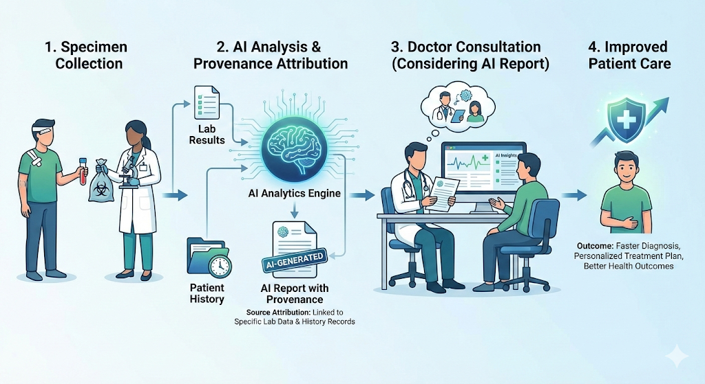
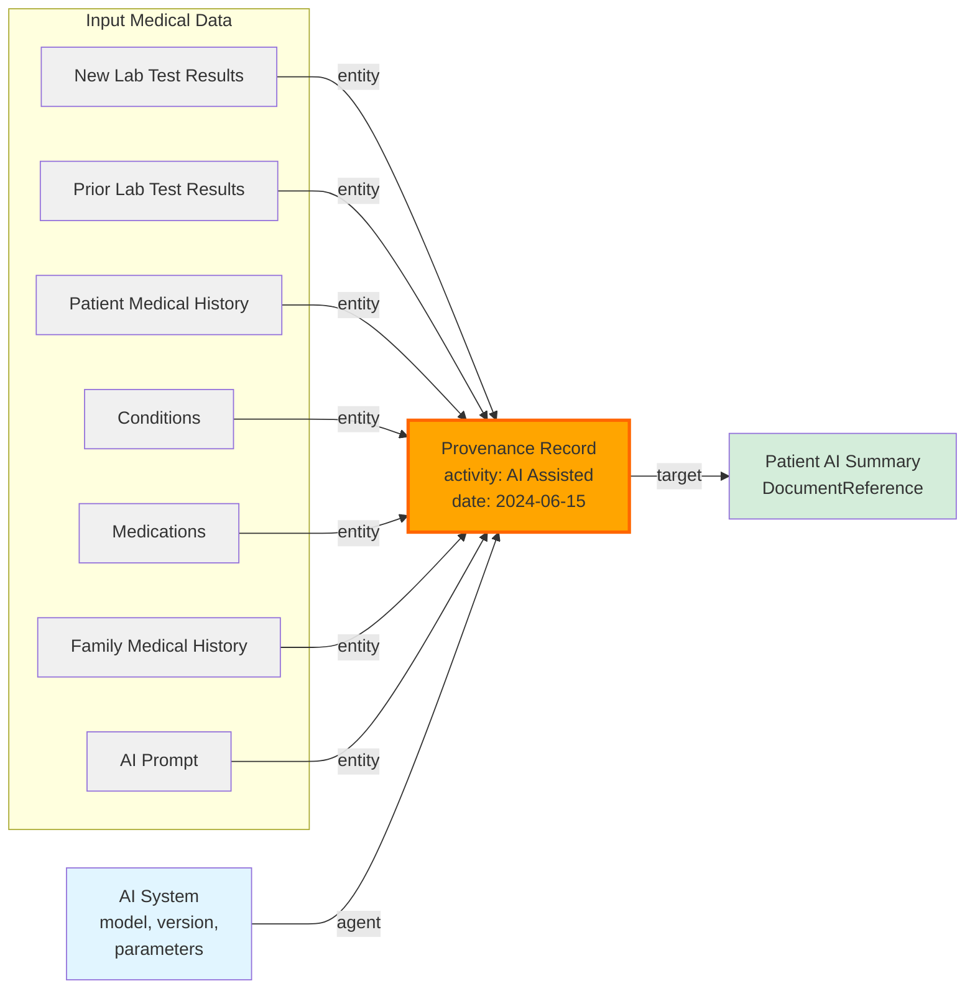

# AI Assisted Patient Appointment

The following scenario is just an example of AI use and the AI Transparency. The intent of the use-case is to show that where AI gets engaged in the Patient care, attribution to the AI needs to be clearly indicated. The AI use in specifically Patient Appointment is not what I am endorsing but rather using it as a representative interaction for the purpose of showing [Provenance and thus Accountability to AI use](https://hl7.org/fhir/uv/aitransparency/index.html).

1. Patient provides lab test specimens prior to appointment.
2. AI analyzes lab test results along with patient history.
3. Patient appointment with Doctor considering AI report.
4. Patient care improved by AI

## Detailed Steps

1. Patient is scheduled for a routine check-up appointment.
2. Patient had provided specimens for lab tests prior to the appointment.
3. On the day of the appointment, an AI is called to analyze the lab test results.
4. The AI considers the lab test results, related to prior lab test results, current conditions, current medications, and family medical history.
5. The [AI generates a summary report](#patient-ai-summary) highlighting any abnormalities or areas of concern.
6. The AI summary report includes various actions that could be recommended based on the analysis.
7. During the appointment, the healthcare provider reviews the [AI-generated report](#patient-ai-summary) with the patient.
8. The healthcare provider discusses any abnormalities or concerns identified in the report.
9. The healthcare provider considers the recommendations from the [AI generated report](#patient-ai-summary) and recommends further tests or lifestyle changes if necessary.
10. The patient is given an opportunity to ask questions and discuss their health.
11. The appointment concludes with a follow-up plan, if needed, and scheduling of the next routine check-up.
12. The AI-generated report is stored in the patient's medical records for future reference. [Patient AI Summary](#patient-ai-summary)
13. The healthcare provider [documents the appointment](#encounter-documentation) details and any recommendations made.
14. The patient receives a [summary of the appointment](#encounter-documentation) and any next steps via their patient portal.

## Patient AI Summary

This document outlines the steps involved in a typical patient appointment for a routine check-up, including the integration of AI analysis for lab test results and AI recommendations.

In this case, since the Patient AI Summary is generated by the AI, the author of the document is the AI system itself. The document may also be tagged with metadata indicating that it was AI-generated.

The summary would itemize the list of history, conditions, medications, lab results, and family history that were considered by the AI in its analysis. It would indicate the new lab test results that were analyzed in the context of prior lab test results and the patient's overall medical history. It would include citations to medical knowledge bases or guidelines that the AI used to inform its analysis and recommendations.

The recommendations would each include a rationale, linking to evidence from the patient's data and relevant medical literature. There would be discussion of benefits, risks, and side effects.

## AI Provenance

Provenance information about the AI analysis is recorded to ensure transparency and accountability. This includes details such as the AI model version, data sources used for analysis, and any relevant parameters or settings applied during the analysis process. This is the focus of the [AI Transparency IG](https://hl7.org/fhir/uv/aitransparency/index.html)

Provenance Details:

- .target = [Patient AI Summary](#patient-ai-summary)
- .agent = AI System ( model, version, parameters )
- .activity = #AI Assisted
- .date = 2024-06-15
- .entity = New Lab Test Results
- .entity = Prior Lab Test Results
- .entity = Patient Medical History
- .entity = Conditions
- .entity = Medications
- .entity = Family Medical History
- .entity = AI Prompt

## Audit the AI

An audit trail is maintained to track the AI's analysis process, ensuring that all steps taken by the AI are documented for future reference. This includes logging the input data, analysis steps, and output results. This is different from Provenance as it records the searches into the patient medical record that the AI made to gather information for its analysis. The audit record of a search typically includes the search request parameters, and does not include the response to the search request. As such the audit analysis would re-run the search to determine what was returned. For example a broad search on a patient record would include all medical history. The AI would likely not process some of this medical history that is determined by the AI to be not relevant. As not relevant data, it would not be included in the AI Provenance as data used by the AI Analysis.  Data the AI considered not relevant to the analysis, such as resolved conditions, resolved broken bones, prior medications no longer being taken, etc. The AI may appropriately pull all historic medical data, as there may be some relevant data in the historic record. The AI can quickly determine what is relevant and what is not relevant. The Audit would include the search of the full medical history, while the Provenance would only include the relevant data used by the AI.

The Audit would include a independent Audit entry for the creation of the [Patient AI Summary](#patient-ai-summary) document itself. This might include the data used, depending on the configuration of the audit system.

If there is some business rule, or privacy consent restriction, that would prevent the AI from accessing certain data in the patient record, the Audit would include the access control denial.

The Audit log would cover everything found in the Provenance, but would be less succinct.

## Encounter Documentation

The healthcare provider documents the appointment details, including any findings from the [AI report](#patient-ai-summary) and recommendations made during the consultation.

The writing of this documentation may also be assisted by AI, which can help summarize the key points discussed during the appointment and ensure that all relevant information is accurately recorded in the patient's medical record. This is a different use of AI from the above, and has different inputs and outputs. This documentation would be authored by the Doctor, with assistance from the AI. Thus another Provenance indicating the AI assistance in documentation, with authorship attribution to the Doctor.

## Patient Summary

The patient receives the [summary of the appointment](#encounter-documentation), including any next steps or recommendations, via their patient portal for easy access and reference.

## AI slop remediation

Now imagine that the healthcare providing organization has learned that the AI model they were using make specific mistakes with specific kinds of lab results. The organization can find all of the Provenance attributed to that AI Model, thus the subset of outputs that that AI Model influenced.  They could further find those Provenance that have a .entity relationship with a given AI Prompt known to have produced poor results, so now have the subset of instances where the AI was used with the defective AI Prompt.
They can then review those outputs, and determine if any patient care was negatively impacted. If so, they can reach out to those patients to remediate the situation. This is an example of how Provenance enables accountability for AI use in healthcare.

## New AI software, Models, and Prompts

When new AI software, models, or prompts are introduced, the healthcare organization can track their adoption and usage through Provenance records. This allows them to monitor the performance and impact of the new AI tools on patient care. If any issues arise, they can quickly identify which AI tools were involved and take appropriate action to address any concerns. This ongoing monitoring and accountability help ensure that AI integration in healthcare continues to benefit patients while minimizing risks.

The change would be represented in a new Device resource representing the new AI software or model, and if there is configured prompt this would also be represented in the Device resource.

The Provenance records for AI analyses would then reference the new Device resource as the .agent, allowing for clear tracking of which AI tools were used in each analysis.
